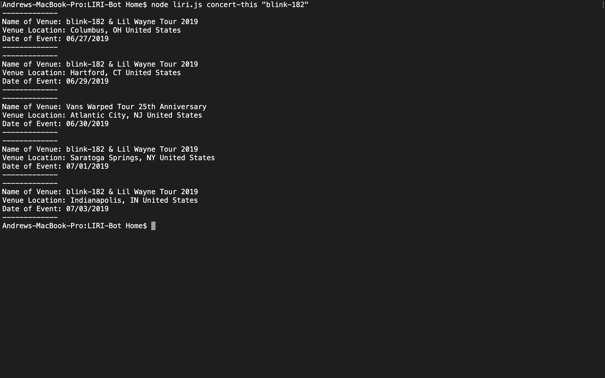
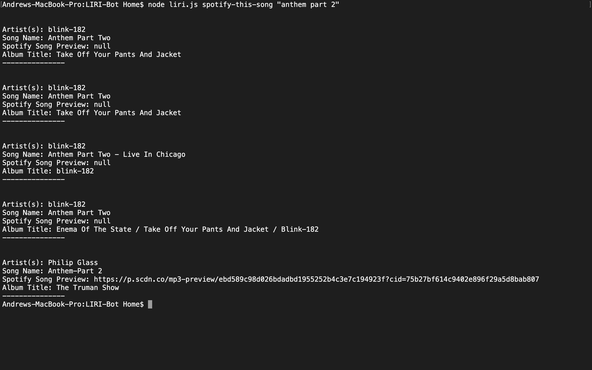
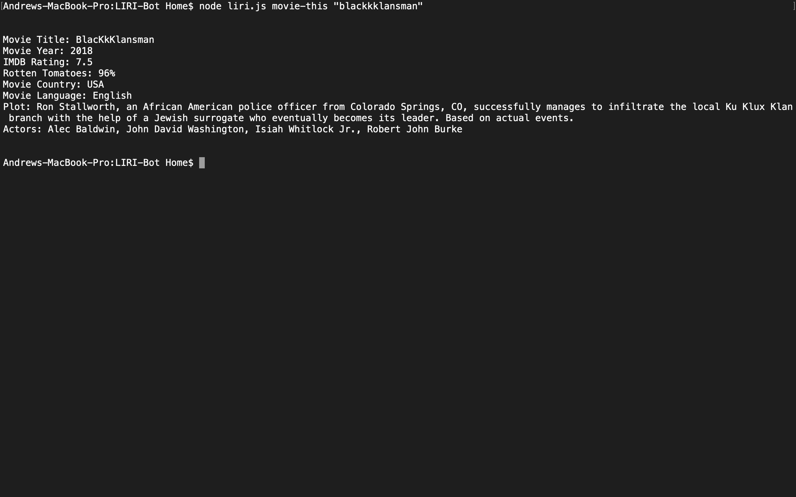
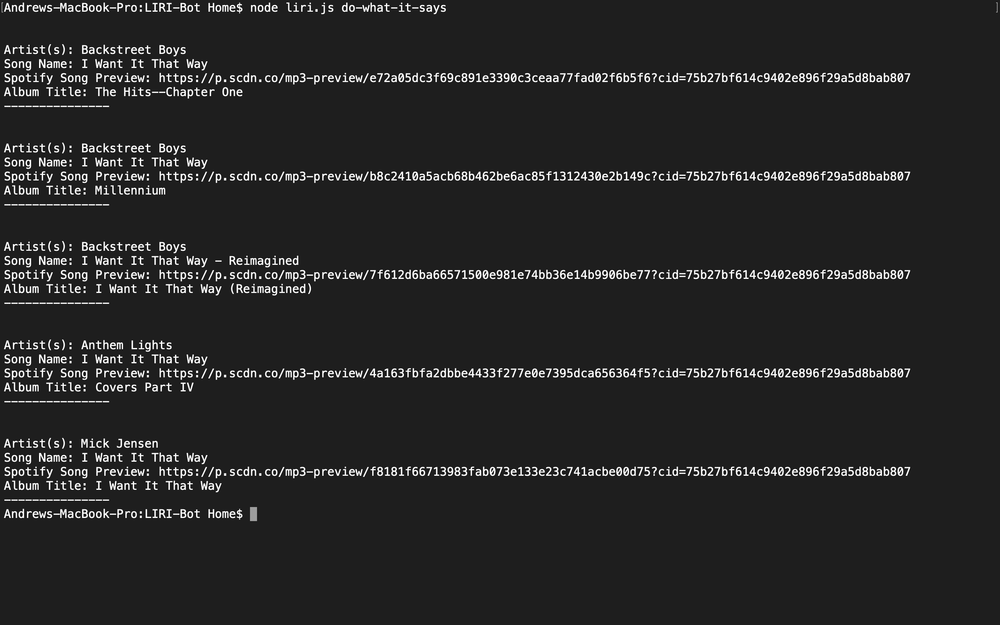

# LIRI-Bot
Node - Language Interpretation and Recognition Interface

## About LIRI-Bot
LIRI-Bot is like iPhone's SIRI, however, it is a Language Interpretation and Recognition Interface. LIRI will take in your parameters in the command line and you gave back data. 

### Commands to run LIRI:
Enter the folowing into the command line to return data:

- node liri.js concert-this "<band name goes here>"

- node liri.js movie-this "<movie title goes here>"

- node liri.js spotify-this-song "<song name goes here>"

- node liri.js do-what-it-says

## Details:

- must be run in command line

- concert-this:
    - uses BandsInTown API
    - will return first 5 pieces of data and provide:
        - name of venue
        - venue location
        - date of the event. Moment was used to reformat the date to (MM/DD/YYYY)
    Example:
        

- spotify-this-song:
    - uses Spotify API to return:
        - Artist(s)
        - The song's name
        - Preview link of the song from Spotify. "null" is presented if no preview available.
        - The album that the song is from.
    Example:
        

- movie-this:
    - uses OMDB API
    - will return the following data:
        - Title
        - Year
        - IMDB Rating
        - Rotten Tomatoes Rating
        - Country produced
        - Language of the movie
        - Plot of the movie
        - Actors in the movie
    - if no movie typed, Mr. Nobody will populate.
    Example:
        

- do-what-it-says:
    - this will run the random.txt file, which has a command to run in spotify.
    Example:
        

## API's and Languages Used:

- BandsInTown API
- OMDB API
- Node-Spotify-API

- Javascript
- Node.js
    - Axios
    - Moment

### My role in this app:
I wrote this app and deployed it to my GitHub.
